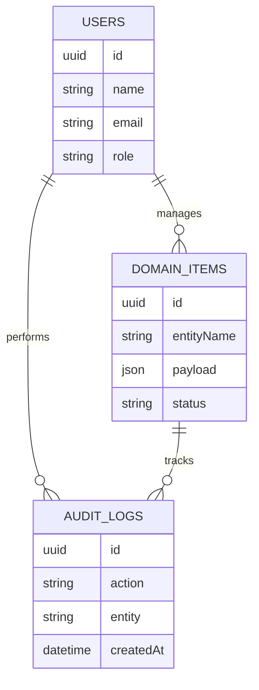

# ER Diagram

This ER diagram describes the main database relationships for Community Dashboard Management System.

## Domain Mapping

The data model includes users, roles, audit logs, and domain collections for Community Beneficiaries, Community Volunteers, Community Donations, Community Requests, Community Campaigns. Key fields include Community Beneficiaries with Community Beneficiary Code, Community Beneficiary Name, Community Category, NGO & Community Management Owner, Community Beneficiary Status, Community Beneficiary Code, Community Need Type, Community Location; Community Volunteers with Community Volunteer Code, Community Volunteer Name, Community Category, NGO & Community Management Owner, Community Volunteer Status, Community Volunteer Code, Community Skill, Community Availability; Community Donations with Community Donation Code, Community Donation Name, Community Category, NGO & Community Management Owner, Community Donation Status, Community Donation Number, Community Donor Name, Community Amount; Community Requests with Community Request Code, Community Request Name, Community Category, NGO & Community Management Owner, Community Request Status, Community Request Number, Community Request Type, Community Priority; Community Campaigns with Community Campaign Code, Community Campaign Name, Community Category, NGO & Community Management Owner, Community Campaign Status, Community Campaign Code, Community Target Amount, Community Impact Count.

## Entity Field Summary

- Community Beneficiaries: Community Beneficiary Code, Community Beneficiary Name, Community Category, NGO & Community Management Owner, Community Beneficiary Status, Community Beneficiary Code, Community Need Type, Community Location
- Community Volunteers: Community Volunteer Code, Community Volunteer Name, Community Category, NGO & Community Management Owner, Community Volunteer Status, Community Volunteer Code, Community Skill, Community Availability
- Community Donations: Community Donation Code, Community Donation Name, Community Category, NGO & Community Management Owner, Community Donation Status, Community Donation Number, Community Donor Name, Community Amount
- Community Requests: Community Request Code, Community Request Name, Community Category, NGO & Community Management Owner, Community Request Status, Community Request Number, Community Request Type, Community Priority
- Community Campaigns: Community Campaign Code, Community Campaign Name, Community Category, NGO & Community Management Owner, Community Campaign Status, Community Campaign Code, Community Target Amount, Community Impact Count
