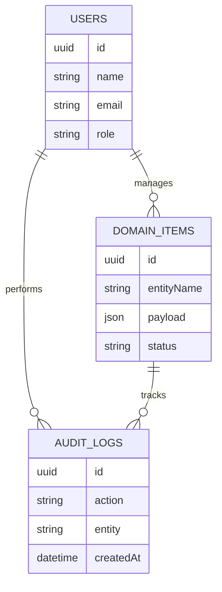
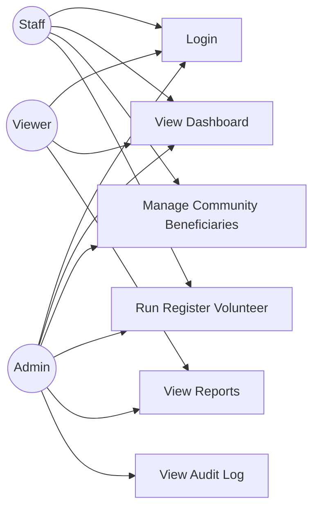
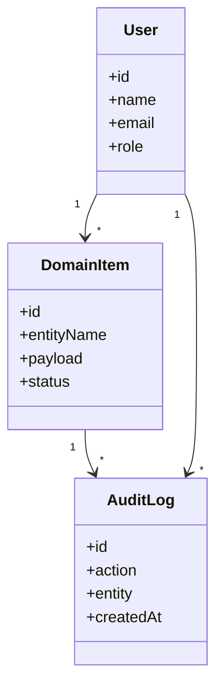
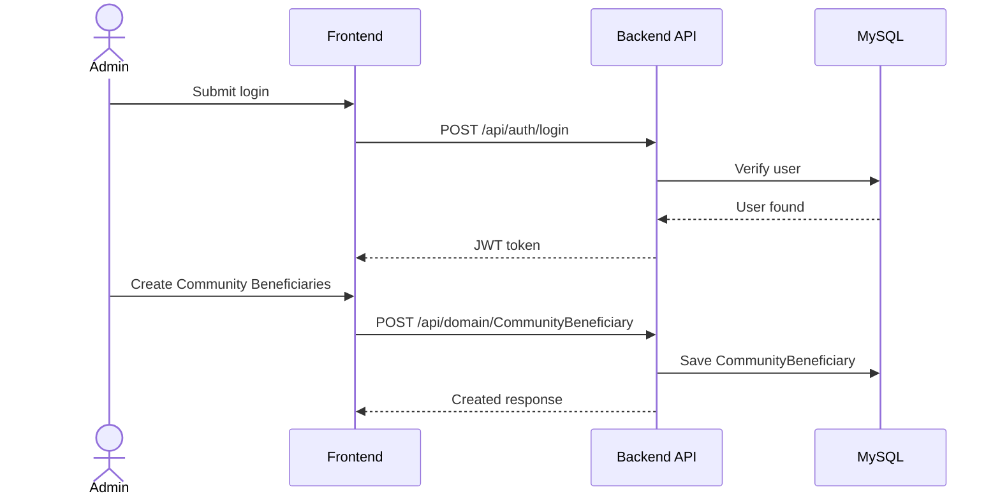

# Community Dashboard Management System Project Report

Generated on 2026-04-27.

# Synopsis

## Project Title

Community Dashboard Management System

## Project Category

Management

## Synopsis

Community Dashboard Management System is a web-based management system designed to help users manage Community Beneficiaries, Community Volunteers, Community Donations, Community Requests, and Community Campaigns through a secure dashboard, structured CRUD workflows, reports, and audit history.

The project uses the Student Project Factory management template and adapts it for the community dashboard domain. It includes domain-specific modules, sample seed data, dashboard statistics, API documentation, and demo credentials so students can run and explain the project confidently.

## Main Features

- Register Volunteer: Register Volunteer for community dashboard with clear steps, ownership, and audit-ready status updates.
- Record Donation: Record Donation for community dashboard with clear steps, ownership, and audit-ready status updates.
- Resolve Community Request: Resolve Community Request for community dashboard with clear steps, ownership, and audit-ready status updates.

## Main Modules

- Dashboard
- Community Beneficiaries
- Community Volunteers
- Community Donations
- Community Requests
- Community Campaigns
- Register Volunteer
- Record Donation
- Resolve Community Request
- Reports
- Audit Trail

## Technology Stack

- Frontend: React + Tailwind
- Backend: Spring Boot
- Database: MySQL
- API Docs: Swagger
- Runtime: Docker Compose

## Domain Entities

- Community Beneficiaries: Community Beneficiary Code, Community Beneficiary Name, Community Category, NGO & Community Management Owner, Community Beneficiary Status, Community Beneficiary Code, Community Need Type, Community Location
- Community Volunteers: Community Volunteer Code, Community Volunteer Name, Community Category, NGO & Community Management Owner, Community Volunteer Status, Community Volunteer Code, Community Skill, Community Availability
- Community Donations: Community Donation Code, Community Donation Name, Community Category, NGO & Community Management Owner, Community Donation Status, Community Donation Number, Community Donor Name, Community Amount
- Community Requests: Community Request Code, Community Request Name, Community Category, NGO & Community Management Owner, Community Request Status, Community Request Number, Community Request Type, Community Priority
- Community Campaigns: Community Campaign Code, Community Campaign Name, Community Category, NGO & Community Management Owner, Community Campaign Status, Community Campaign Code, Community Target Amount, Community Impact Count

## Domain Workflows

- Register Volunteer: Capture Profile -> Verify Availability -> Assign Campaign -> Activate Volunteer
- Record Donation: Add Donor -> Capture Amount -> Issue Receipt -> Update Fund
- Resolve Community Request: Review Request -> Assign Volunteer -> Deliver Support -> Close Request

## Demo Access

```txt
Email: admin@example.com
Password: Admin@123
```


---

# Abstract

Community Dashboard Management System is developed to simplify and digitize the daily operations of a community dashboard management environment. Manual record keeping can cause delays, duplicate entries, weak reporting, and difficulty in tracking important activities. This system provides a centralized platform for managing Community Beneficiaries, Community Volunteers, Community Donations, Community Requests, and Community Campaigns with proper authentication, validation, reports, and audit logs.

The application follows a modular architecture with separate frontend, backend, and database layers. The frontend uses React + Tailwind to provide a clean student-friendly dashboard, while the backend uses Spring Boot to expose REST APIs documented through Swagger. MySQL stores structured data such as Community Beneficiaries, Community Volunteers, Community Donations, Community Requests, and Community Campaigns and configured domain workflows.

The project includes seed data based on domain records with code, title, description, and status, staff users and administrators, and Register Volunteer, Record Donation, Resolve Community Request. This makes the system easy to demonstrate during project reviews, viva sessions, and final-year submissions.


---

# Problem Statement

Organizations in the community dashboard domain often manage Community Beneficiaries, Community Volunteers, Community Donations, Community Requests, and Community Campaigns using paper registers, spreadsheets, or disconnected tools. These methods become difficult to maintain as data volume increases.

## Existing Problems

- Data is scattered across multiple files or registers.
- Searching and updating Community Beneficiaries takes unnecessary time.
- Reports are prepared manually and may contain mistakes.
- Tracking Register Volunteer and recent activity is difficult.
- There is no consistent audit history for important changes.
- Students and administrators cannot easily demonstrate a complete digital workflow.

## Proposed Problem Solution

Community Dashboard Management System solves these issues by providing a centralized web application with login, dashboard statistics, CRUD modules, reports, seed data, and documented APIs. The system is designed so that users can manage Community Beneficiaries, Community Volunteers, Community Donations, Community Requests, and Community Campaigns in a structured and reliable way.


---

# Objectives

The main objective of Community Dashboard Management System is to build a complete and easy-to-understand management system for the community dashboard domain.

## Primary Objectives

- Provide secure admin login and protected dashboard access.
- Manage Community Beneficiaries, Community Volunteers, Community Donations, Community Requests, and Community Campaigns using CRUD operations.
- Store all project data in MySQL.
- Provide dashboard statistics such as Active Volunteers, Total Donations, Open Requests, and Running Campaigns.
- Generate reports for monitoring and decision-making.
- Maintain audit logs for important user actions.
- Provide Swagger API documentation for backend testing.
- Include seed data for quick demonstration.

## Learning Objectives

- Understand full-stack project structure.
- Learn REST API design using Spring Boot.
- Practice database modeling and relationships.
- Build reusable frontend components.
- Use Docker Compose for local deployment.
- Prepare documentation required for college submission.


---

# Major Project Profile

## Project Category

Final Year Major Project

## Complexity

advanced

## Problem Depth

Community Dashboard Management System is positioned as a final-year major project.

## Advanced Modules

- Advanced module enrichment not available.

## Major Workflows

- Workflow enrichment not available.

## Analytics Reports

- Analytics enrichment not available.

## Config-Driven Generation Scope

Generation mode: deterministic-config

- Domain configuration was used for modules, workflows, seed data, and documentation.

## Acceptance Tests

- Standard validation checks apply.


---

# System Requirements

## Functional Requirements

- The system shall allow admin login using demo credentials.
- The system shall display dashboard statistics for Community Dashboard Management System.
- The system shall allow users to create, view, update, and delete Community Beneficiaries, Community Volunteers, Community Donations, Community Requests, and Community Campaigns.
- The system shall support searching and filtering Community Beneficiaries.
- The system shall provide reports for key project data.
- The system shall maintain audit logs for important actions.
- The system shall expose REST APIs with Swagger documentation.

## Non-Functional Requirements

- The system should be easy to run locally.
- The UI should be simple and student-friendly.
- API responses should be structured and consistent.
- The database should support project data and domain-specific seed data.
- The project should be portable through Docker Compose.
- Documentation should be clear enough for viva and submission.

## Users

- Admin
- Staff or operator
- Viewer or report user


---

# Software Requirements

## Development Software

- Node.js 20 or later
- pnpm package manager
- Docker Desktop or Docker Engine
- MySQL, provided through Docker Compose or local configuration
- VS Code, Cursor, or another code editor
- Git

## Application Software

- Frontend: React + Tailwind
- Backend framework: Spring Boot
- Database: MySQL
- API documentation: Swagger
- Authentication: JWT-based auth structure

## Browser Requirement

Any modern browser such as Chrome, Edge, Firefox, or Safari can be used to access the frontend and Swagger documentation.


---

# Hardware Requirements

## Minimum Requirements

- Processor: Dual-core processor
- RAM: 4 GB
- Storage: 2 GB free space
- Network: Localhost access for frontend, backend, and database services

## Recommended Requirements

- Processor: Quad-core processor
- RAM: 8 GB or more
- Storage: 5 GB free space
- Docker-compatible development machine

## Deployment Environment

For college demonstration, the project can run on a laptop using Docker Compose. A separate production server is not required for basic project submission.


---

# Module Description

Community Dashboard Management System is divided into modules so each part of the system has a clear responsibility.

## Core Modules

- Dashboard: Shows Community Beneficiaries, Community Volunteers, Community Donations, Community Requests, and Community Campaigns statistics, insight panels, and domain workflow status.
- Community Beneficiaries: Manages community beneficiaries with community beneficiary code, community beneficiary name, community category, ngo & community management owner, community beneficiary status, community beneficiary code, community need type, community location.
- Community Volunteers: Manages community volunteers with community volunteer code, community volunteer name, community category, ngo & community management owner, community volunteer status, community volunteer code, community skill, community availability.
- Community Donations: Manages community donations with community donation code, community donation name, community category, ngo & community management owner, community donation status, community donation number, community donor name, community amount.
- Community Requests: Manages community requests with community request code, community request name, community category, ngo & community management owner, community request status, community request number, community request type, community priority.
- Community Campaigns: Manages community campaigns with community campaign code, community campaign name, community category, ngo & community management owner, community campaign status, community campaign code, community target amount, community impact count.
- Register Volunteer: Supports workflow steps such as Capture Profile, Verify Availability, Assign Campaign, Activate Volunteer.
- Record Donation: Supports workflow steps such as Add Donor, Capture Amount, Issue Receipt, Update Fund.
- Resolve Community Request: Supports workflow steps such as Review Request, Assign Volunteer, Deliver Support, Close Request.
- Reports: Provides summary views for Community Beneficiaries, Community Volunteers, Community Donations, Community Requests, and Community Campaigns and configured workflows.
- Audit Trail: Tracks important actions performed in the system.

## Domain Entities

- Community Beneficiaries: Community Beneficiary Code, Community Beneficiary Name, Community Category, NGO & Community Management Owner, Community Beneficiary Status, Community Beneficiary Code, Community Need Type, Community Location
- Community Volunteers: Community Volunteer Code, Community Volunteer Name, Community Category, NGO & Community Management Owner, Community Volunteer Status, Community Volunteer Code, Community Skill, Community Availability
- Community Donations: Community Donation Code, Community Donation Name, Community Category, NGO & Community Management Owner, Community Donation Status, Community Donation Number, Community Donor Name, Community Amount
- Community Requests: Community Request Code, Community Request Name, Community Category, NGO & Community Management Owner, Community Request Status, Community Request Number, Community Request Type, Community Priority
- Community Campaigns: Community Campaign Code, Community Campaign Name, Community Category, NGO & Community Management Owner, Community Campaign Status, Community Campaign Code, Community Target Amount, Community Impact Count

## Domain Workflows

- Register Volunteer: Capture Profile -> Verify Availability -> Assign Campaign -> Activate Volunteer
- Record Donation: Add Donor -> Capture Amount -> Issue Receipt -> Update Fund
- Resolve Community Request: Review Request -> Assign Volunteer -> Deliver Support -> Close Request

## Dashboard Statistics

- Active Volunteers
- Total Donations
- Open Requests
- Running Campaigns

## Unique Domain Features

- Register Volunteer: Register Volunteer for community dashboard with clear steps, ownership, and audit-ready status updates.
- Record Donation: Record Donation for community dashboard with clear steps, ownership, and audit-ready status updates.
- Resolve Community Request: Resolve Community Request for community dashboard with clear steps, ownership, and audit-ready status updates.

## Seed Data Theme

- Primary Data: domain records with code, title, description, and status
- People / Owners: staff users and administrators
- Workflows: Register Volunteer, Record Donation, Resolve Community Request


---

# ER Diagram

This ER diagram describes the main database relationships for Community Dashboard Management System.



## Domain Mapping

The data model includes users, roles, audit logs, and domain collections for Community Beneficiaries, Community Volunteers, Community Donations, Community Requests, Community Campaigns. Key fields include Community Beneficiaries with Community Beneficiary Code, Community Beneficiary Name, Community Category, NGO & Community Management Owner, Community Beneficiary Status, Community Beneficiary Code, Community Need Type, Community Location; Community Volunteers with Community Volunteer Code, Community Volunteer Name, Community Category, NGO & Community Management Owner, Community Volunteer Status, Community Volunteer Code, Community Skill, Community Availability; Community Donations with Community Donation Code, Community Donation Name, Community Category, NGO & Community Management Owner, Community Donation Status, Community Donation Number, Community Donor Name, Community Amount; Community Requests with Community Request Code, Community Request Name, Community Category, NGO & Community Management Owner, Community Request Status, Community Request Number, Community Request Type, Community Priority; Community Campaigns with Community Campaign Code, Community Campaign Name, Community Category, NGO & Community Management Owner, Community Campaign Status, Community Campaign Code, Community Target Amount, Community Impact Count.

## Entity Field Summary

- Community Beneficiaries: Community Beneficiary Code, Community Beneficiary Name, Community Category, NGO & Community Management Owner, Community Beneficiary Status, Community Beneficiary Code, Community Need Type, Community Location
- Community Volunteers: Community Volunteer Code, Community Volunteer Name, Community Category, NGO & Community Management Owner, Community Volunteer Status, Community Volunteer Code, Community Skill, Community Availability
- Community Donations: Community Donation Code, Community Donation Name, Community Category, NGO & Community Management Owner, Community Donation Status, Community Donation Number, Community Donor Name, Community Amount
- Community Requests: Community Request Code, Community Request Name, Community Category, NGO & Community Management Owner, Community Request Status, Community Request Number, Community Request Type, Community Priority
- Community Campaigns: Community Campaign Code, Community Campaign Name, Community Category, NGO & Community Management Owner, Community Campaign Status, Community Campaign Code, Community Target Amount, Community Impact Count


---

# UML Diagrams

## Use Case Diagram



## Class Diagram



## Sequence Diagram




---

# API Documentation

The backend exposes REST APIs for Community Dashboard Management System. Swagger documentation is available at:

```txt
http://localhost:18080/api/docs
```

## Authentication

| Method | Endpoint | Purpose |
| --- | --- | --- |
| POST | `/api/auth/login` | Login and receive an access token |

## Common APIs

| Method | Endpoint | Purpose |
| --- | --- | --- |
| GET | `/api/health` | Check backend health |
| GET | `/api/dashboard/stats` | Fetch dashboard statistics |
| GET | `/api/reports/summary` | View report summary |
| GET | `/api/audit-log` | View audit history |

## Domain APIs

| Method | Endpoint | Purpose |
| --- | --- | --- |
| GET | `/api/domain/CommunityBeneficiary` | List Community Beneficiaries |
| POST | `/api/domain/CommunityBeneficiary` | Create Community Beneficiaries entry |
| GET | `/api/domain/CommunityVolunteer` | List Community Volunteers |
| POST | `/api/domain/CommunityVolunteer` | Create Community Volunteers entry |
| GET | `/api/domain/CommunityDonation` | List Community Donations |
| POST | `/api/domain/CommunityDonation` | Create Community Donations entry |
| GET | `/api/domain/CommunityRequest` | List Community Requests |
| POST | `/api/domain/CommunityRequest` | Create Community Requests entry |
| GET | `/api/domain/CommunityCampaign` | List Community Campaigns |
| POST | `/api/domain/CommunityCampaign` | Create Community Campaigns entry |

## Demo Login

```json
{
  "email": "admin@example.com",
  "password": "Admin@123"
}
```


---

# Test Cases

| Test Case ID | Scenario | Steps | Expected Result |
| --- | --- | --- | --- |
| TC-001 | Admin login | Enter valid demo credentials and submit | Dashboard opens successfully |
| TC-002 | Invalid login | Enter wrong password and submit | Error message is displayed |
| TC-003 | View dashboard | Login and open dashboard | Statistics for Active Volunteers, Total Donations, Open Requests, and Running Campaigns are shown |
| TC-004 | Create CommunityBeneficiary | Open Community Beneficiaries page and submit valid form | New CommunityBeneficiary entry is created |
| TC-005 | Edit record | Update an existing Community Beneficiaries item | Updated values are saved |
| TC-006 | Delete record | Delete an existing item after confirmation | Item is removed or marked inactive |
| TC-007 | Search Community Beneficiaries | Search by domain fields | Matching Community Beneficiaries are displayed |
| TC-008 | View reports | Open reports page | Summary report loads correctly |
| TC-009 | Swagger check | Open `/api/docs` | Swagger documentation is visible |
| TC-010 | Health check | Call `/api/health` | API returns healthy status |

## Domain-Specific Test Focus

The tester should verify that seed data correctly represents domain records with code, title, description, and status, staff users and administrators, and Register Volunteer, Record Donation, Resolve Community Request.


---

# Future Scope

Community Dashboard Management System can be extended with more advanced features after the base project is complete.

## Possible Enhancements

- Add role-based permissions for each module.
- Add advanced analytics and charts.
- Add PDF and Excel export for reports.
- Add email or SMS notifications.
- Add file upload support for documents and receipts.
- Add multi-branch or multi-location support.
- Add mobile-friendly progressive web app behavior.
- Add automated backups for MySQL.
- Add approval workflows for important Register Volunteer actions.

## Domain-Specific Enhancements

- Register Volunteer: Register Volunteer for community dashboard with clear steps, ownership, and audit-ready status updates.
- Record Donation: Record Donation for community dashboard with clear steps, ownership, and audit-ready status updates.
- Resolve Community Request: Resolve Community Request for community dashboard with clear steps, ownership, and audit-ready status updates.


---

# Conclusion

Community Dashboard Management System provides a complete full-stack management project for the community dashboard domain. It solves common problems related to manual record keeping, slow searching, weak reporting, and lack of centralized data.

The system includes secure login, dashboard statistics, CRUD modules, reports, audit logs, seed data, API documentation, and Docker-based setup. The project also helps students understand frontend development, backend APIs, database design, authentication, deployment, and project documentation.

Overall, Community Dashboard Management System is suitable for college demonstrations, viva preparation, and final-year project submission because it combines practical domain features with a clear and explainable technical architecture.

