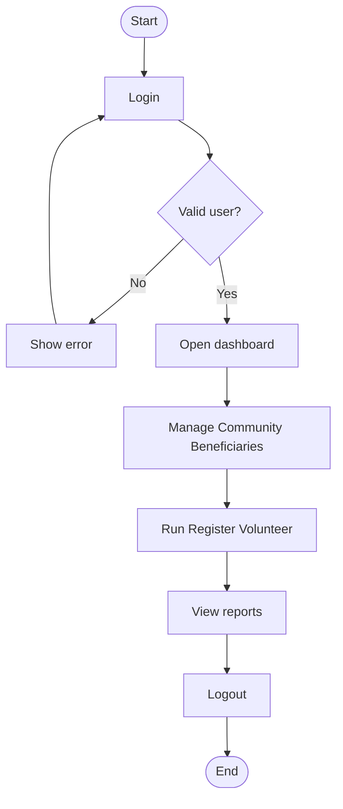

# Activity Diagram

```mermaid
flowchart TD
  Start([Start]) --> Login[Login]
  Login --> Valid{Valid user?}
  Valid -- No --> Error[Show error]
  Error --> Login
  Valid -- Yes --> Dashboard[Open dashboard]
  Dashboard --> Manage[Manage Community Beneficiaries]
  Manage --> Workflow[Run Register Volunteer]
  Workflow --> Report[View reports]
  Report --> Logout[Logout]
  Logout --> End([End])
```
