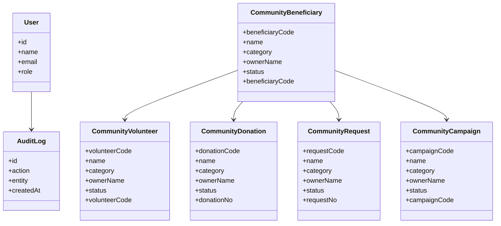

# Class Diagram

```mermaid
classDiagram
  class User {
    +id
    +name
    +email
    +role
  }
  class CommunityBeneficiary {
    +beneficiaryCode
    +name
    +category
    +ownerName
    +status
    +beneficiaryCode
  }
  class CommunityVolunteer {
    +volunteerCode
    +name
    +category
    +ownerName
    +status
    +volunteerCode
  }
  class CommunityDonation {
    +donationCode
    +name
    +category
    +ownerName
    +status
    +donationNo
  }
  class CommunityRequest {
    +requestCode
    +name
    +category
    +ownerName
    +status
    +requestNo
  }
  class CommunityCampaign {
    +campaignCode
    +name
    +category
    +ownerName
    +status
    +campaignCode
  }
  class AuditLog {
    +id
    +action
    +entity
    +createdAt
  }
  CommunityBeneficiary --> CommunityVolunteer
  CommunityBeneficiary --> CommunityDonation
  CommunityBeneficiary --> CommunityRequest
  CommunityBeneficiary --> CommunityCampaign
  User --> AuditLog
```
